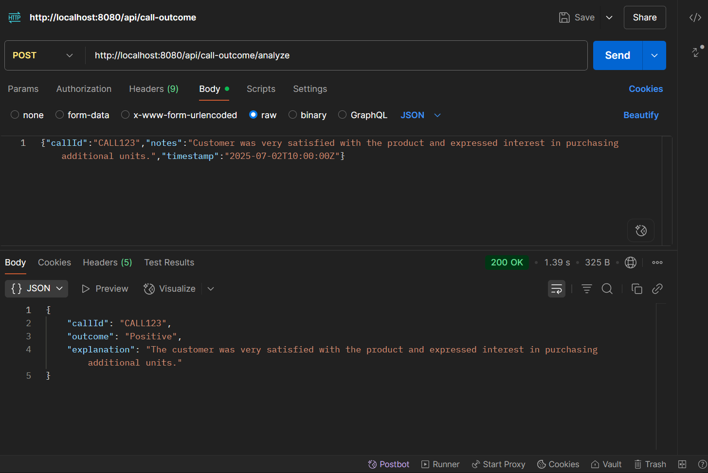

# AI-Powered Call Outcome Analysis Service

[](https://www.oracle.com/java/technologies/downloads/)
[](https://spring.io/projects/spring-boot)
[](https://spring.io/projects/spring-ai)
[](https://opensource.org/licenses/MIT)

A modern Spring Boot service that leverages the power of Generative AI to analyze customer call notes, determine the sentiment (Positive, Negative, or Neutral), and provide a concise explanation. This service features a stateful, conversational memory for each call, allowing for context-aware follow-up analysis.

## ✨ Key Features

-   **Intelligent Analysis**: Uses Spring AI and an underlying Large Language Model (LLM) like OpenAI's GPT to understand the nuances of call notes.
-   **Conversational Memory**: Maintains a complete message history for each unique `callId`, enabling contextual and follow-up interactions.
-   **Stateful & Thread-Safe**: Employs a `ConcurrentHashMap` for robust, in-memory, and thread-safe conversation management.
-   **Structured JSON API**: Accepts and returns clean, predictable JSON objects for easy integration.
-   **Robust Error Handling**: Gracefully handles potential issues during AI interaction and response parsing.
-   **Easy to Run**: Built with Maven and Spring Boot for a straightforward setup and launch process.

## 🚀 Getting Started

Follow these instructions to get the project up and running on your local machine.

### Prerequisites

-   Java 21 or later
-   Apache Maven
-   An OpenAI API Key

### Installation & Configuration

1.  **Clone the repository:**
    ```bash
    git clone <your-repository-url>
    cd call_outcome
    ```

2.  **Configure your OpenAI API Key:**
    
    The application requires an OpenAI API key to function. You can configure it in one of the following ways:
    
    **Option A: Using Environment Variable (Recommended)**
    ```bash
    # For macOS/Linux
    export OPENAI_API_KEY=your-api-key-here
    
    # For Windows (Command Prompt)
    set OPENAI_API_KEY=your-api-key-here
    
    # For Windows (PowerShell)
    $env:OPENAI_API_KEY="your-api-key-here"
    ```
    
    **Option B: Direct Configuration (Not recommended for production)**
    
    Edit `src/main/resources/application.properties` and replace the environment variable reference:
    ```properties
    spring.ai.openai.api-key=your-actual-api-key-here
    ```
    
    > **Note:** The `application.properties` file uses `${OPENAI_API_KEY}` to read the API key from environment variables. This is the recommended approach to keep your API key secure and out of version control.

3.  **Build the project:**
    Use the Maven wrapper to build the application and install dependencies.
    ```bash
    # For Windows
    .\mvnw clean install

    # For macOS/Linux
    ./mvnw clean install
    ```

4.  **Run the application:**
    ```bash
    # For Windows
    .\mvnw spring-boot:run

    # For macOS/Linux
    ./mvnw spring-boot:run
    ```
    The service will start on the default port (usually `8080`).

## 🛠️ API Usage

The service exposes REST endpoints to analyze call notes and retrieve conversation history.

*(Note: You will need to create a `RestController` to expose the `CallOutcomeService` methods.)*

### Analyze Call Notes

-   **Endpoint**: `POST /api/v1/analyze`
-   **Content-Type**: `application/json`
-   **Description**: Submits call notes for analysis. The service will return a classification and an explanation.

**Request Body (`CallNotes.java`):**
```json
{
  "callId": "call-abc-123",
  "notes": "The customer was very happy with the resolution and mentioned they would recommend our service to their friends."
}

